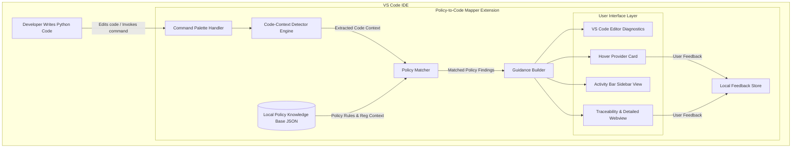

# Architecture Overview

## 1. Local-First Architecture Principle

**Policy-to-Code Mapper** operates entirely within the Visual Studio Code extension runtime. It relies on local TypeScript pattern detection and local JSON policy records. It does not require remote backends, cloud databases, external APIs, or LLM services for its core functionality.

## 2. High-Level Architecture Diagram

## 3. Core Architectural Modules

1. **Commands Module (`src/commands/`)**: Handles extension activation and user-initiated commands from the VS Code Command Palette.
2. **Analyzer Engine (`src/analyzer/`)**: Evaluates source code lines for logging functions and sensitive identifiers using deterministic, conservative pattern matching.
3. **Policies Module (`src/policies/`)**: Loads, validates, and manages local JSON policy records (`resources/policies.json`).
4. **Guidance Module (`src/guidance/`)**: Constructs standardized policy findings, diagnostics, hover hoverable Markdown, and full traceability chains.
5. **Views Module (`src/views/`)**: Manages the Activity Bar Tree View and Webview details panels.
6. **Feedback Store (`src/feedback/`)**: Records local, anonymous developer feedback on guidance relevance and helpfulness without network transmission.

## 4. Design Trade-offs & Security Guarantee

* **Privacy & Isolation:** Code never leaves the developer's local machine.
* **Low Overhead:** Lightweight TypeScript regex matching avoids heavy background processes or AST overhead in the initial MVP.
* **Non-Blocking Execution:** All UI elements operate asynchronously without blocking editor input or background compilation.
